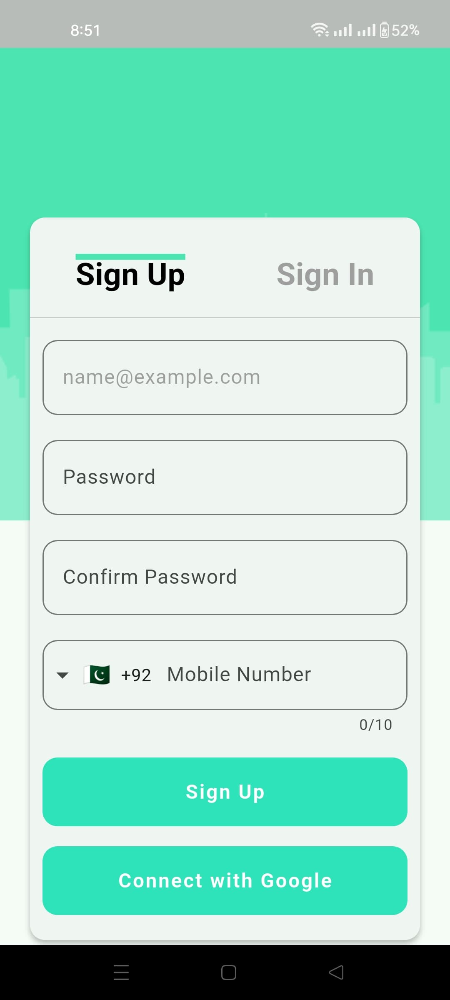
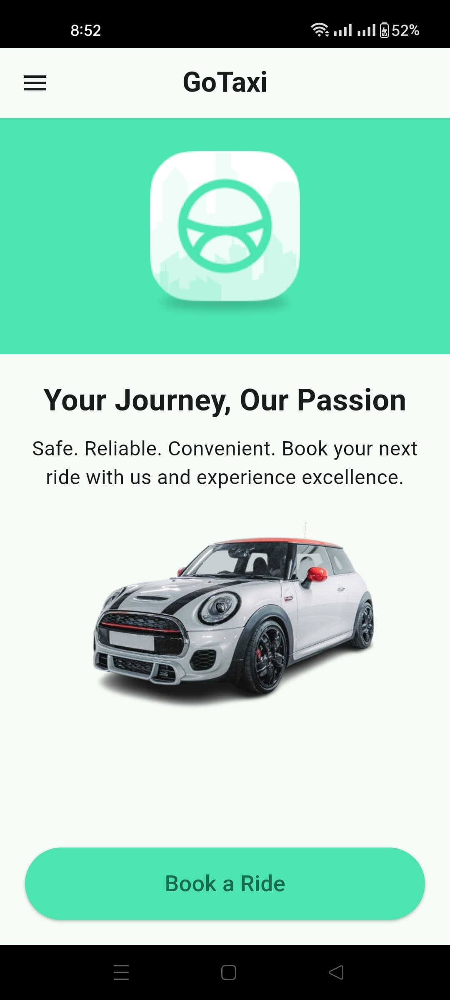
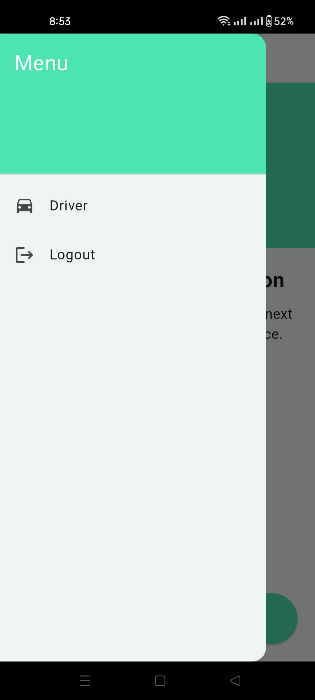

# Go_Taxi
App just like uber and indrive with a personalized touch to it

<table>
  <tr>
    <td align="center">
      <h2>Splash Screen</h2>
      <h3>Below is the Splash screen for the App<h3>
      
    </td>
    <td align="center">
      <h2>InfoScreen</h2>
      <h3>Starting InfoScreen<h3>
      
    </td>
  </tr>
</table>
        
<table>
  <tr>
    <td align="center">
      <h2>Getting Started</h2>
      <h3>This Screen is where the funclinality starts.<h3>
      
    </td>
    <td align="center">
      <h2>Location Permission</h2>
      <h3>Prompted when giving Location Permission.<h3>
      
    </td>
  </tr>
</table>

<table>
  <tr>
    <td align="center">
      <h2>SignUp Screen</h2>
      <h3>This Screen helps you SignUp.<h3>
      
    </td>
    <td align="center">
      <h2>Login Screen</h2>
      <h3>If SignedUp you can directly LogIn.<h3>
      
    </td>
  </tr>
</table>

<table>
  <tr>
    <td align="center">
      <h2>Permission Screen</h2>
      <h3>Takes Loction Permission.<h3>
      
    </td>
    <td align="center">
      <h2>OTP Screen</h2>
      <h3>Verifies OTP sent to Phone Number.<h3>
      
    </td>
  </tr>
</table>

<table>
  <tr>
    <td align="center">
      <h2>OTP Screen</h2>
      <h3>Filled OTP fields.<h3>
      
    </td>
    <td align="center">
      <h2>HomeScreen</h2>
      <h3>Starting Page of the App.<h3>
      
    </td>
  </tr>
</table>

<table>
  <tr>
    <td align="center">
      <h2>Ride Booking Screen</h2>
      <h3>Book A Ride from this Screen.<h3>
      
    </td>
    <td align="center">
      <h2>Ride Booking Screen</h2>
      <h3>Location Entered.<h3>
      
    </td>
  </tr>
</table>

<table>
  <tr>
    <td align="center">
      <h2>Ride Booking Screen</h2>
      <h3>Waiting for Driver once Ride is booked.<h3>
      
    </td>
    <td align="center">
      <h2>Drawer</h2>
      <h3>Drawer On HomeScreen.<h3>
      
    </td>
  </tr>
</table>

<table>
  <tr>
    <td align="center">
      <h2>Driver Registration Screen</h2>
      <h3>New Driver Registration.<h3>
      
    </td>
    <td align="center">
      <h2>Driver Registration Screen</h2>
      <h3>Driver Registration fields filled.<h3>
      
    </td>
  </tr>
</table>

<table>
  <tr>
    <td align="center">
      <h2>Driver HomeScreen</h2>
      <h3>Driver Pending to be Approved.<h3>
      
    </td>
    <td align="center">
      <h2>Driver HomeScreen</h2>
      <h3>Once Driver is Approved he can accept Ride Requests.<h3>
      
    </td>
  </tr>
</table>
